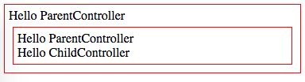

AngularJS1 "Controller As" Demo
===============================

Use `controller as someVar`, we can use the controller itself as the `$scope`.

```
npm install
open index.html
```



Resources
---------

- <https://beginor.github.io/2016/04/05/angularjs-controller-as.html>